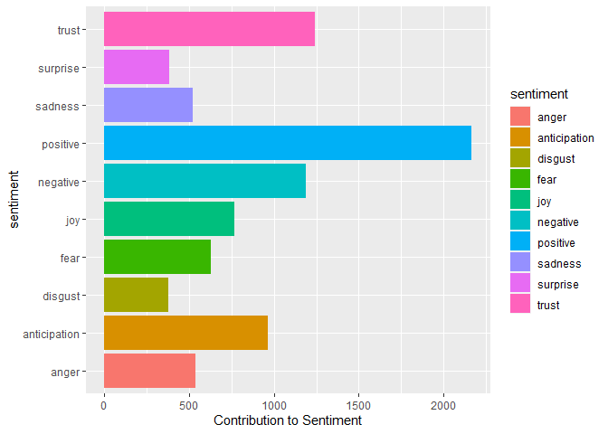

R_Env_Ctrl.Rmd - Interactive Setup Documentation
================
Brian Buonauro
2023-02-23

## Environment Setup

### R Libraries

``` r
library(tidyverse)
```

    ## ── Attaching packages ─────────────────────────────────────── tidyverse 1.3.2 ──
    ## ✔ ggplot2 3.4.0      ✔ purrr   0.3.5 
    ## ✔ tibble  3.1.8      ✔ dplyr   1.0.10
    ## ✔ tidyr   1.2.1      ✔ stringr 1.4.1 
    ## ✔ readr   2.1.3      ✔ forcats 0.5.2 
    ## ── Conflicts ────────────────────────────────────────── tidyverse_conflicts() ──
    ## ✖ dplyr::filter() masks stats::filter()
    ## ✖ dplyr::lag()    masks stats::lag()

To begin, we will go over the libraries used to build this project.
Please note that some of this code will repeat itself in the second R
script since the cmd-based automation used will run them as if they’re
in separate environments. For general data cleaning purposes, we will
defer to Tidyverse, mostly for the dplyr package. I will implement a lot
of the cleaning and text manipulation strategies from my last project,
reviewing [Fiverr data](https://github.com/bmb179/Fiverr-Text-Analysis)
that was scraped by a third party.

------------------------------------------------------------------------

``` r
library(reticulate)
twint <- import("twint")
pandas <- import("pandas")
```

The main purpose of this project is to scrape Twitter on a recurring
basis in order to assess online threats as they happen. Unfortunately,
this cannot be done in R without an API key. These keys have been
notoriously difficult to obtain, even more so recently following
Twitter’s chaotic reorganization as a privately-held company. However, a
Python library exists to serve this functionality without an API key
known as [Twint](https://github.com/twintproject/twint). Using R’s
Reticulate library, we can execute Python code within the R environment
by importing Twint and it’s dependent library Pandas. I am admittedly
not familiar with Python yet and it took some tinkering to get it
running properly within R.

Some important things to note if you wish to run this yourself:

- Have a locally installed Python version of 3.6 or greater.

- Import Twint and all its dependencies.

------------------------------------------------------------------------

``` r
library(tidytext)
library(textdata)
nrc <- get_sentiments("nrc")
```

I will be utilizing the Tidytext library in this project to achieve more
advanced text analysis. By doing so I will be implementing techniques
that I learned in a book that I am currently getting through, [Text
Mining with R](https://www.tidytextmining.com/). The NRC Emotional
Lexicon will be used for the sentiment analysis portion of this project
since I feel that it will most accurately depict how the same word can
have multiple different emotional meanings in common speech. As a
result, the Textdata library will be utilized for access to this
lexicon.

------------------------------------------------------------------------

``` r
library(RSQLite)
```

To write the cleaned data to a database for storage and further
manipulation, we will utilize SQLite. At an enterprise level, it would
be preferable to connect to a server-based platform such as Postgres or
SQL Server so that colleagues can simultaneously use it. For the purpose
of this project, it would be more efficient to have the database stored
as a local file that can be shared to negate having to share output CSV
files of finished analyses. As a result, SQLite is a natural choice for
this project. In order to manage the interaction between R and the
database, I have enlisted the RSQLite library that will allow the
execution of queries within R code, much like Reticulate does with
Python.

------------------------------------------------------------------------

``` r
library(taskscheduleR)
```

The last R library required for this project is TaskscheduleR in order
to automate the execution of the R script and writing it to the SQLite
database without the involvement of outside administration tools. This
library will require a Windows OS capable of running the most recent
version of R and may not work properly based on your time format, but
the R script can be run manually or with outside software if
TaskscheduleR won’t cooperate on your system.

------------------------------------------------------------------------

### DB Setup

Now that the R environment is complete, we need to set up the database.
This process will start by connecting to the database
“twitter_data.sqlite”. R will write this file to the working directory
if the file doesn’t already exist there.

``` r
db <- dbConnect(SQLite(), "twitter_data.sqlite")

dbExecute(db, "CREATE TABLE IF NOT EXISTS tweets 
(id NUMERIC, conversation_id NUMERIC, created_at NUMERIC, date TIMESTAMP, 
timezone VARCHAR, place VARCHAR, tweet VARCHAR, language VARCHAR, hashtags VARCHAR, 
cashtags VARCHAR, user_id NUMERIC, user_id_str VARCHAR, username VARCHAR, name VARCHAR,
day TINYINT, hour TINYINT, link VARCHAR, urls VARCHAR, photos VARCHAR, video TINYINT,
thumbnail VARCHAR, retweet BOOLEAN, nlikes NUMERIC, nreplies NUMERIC, nretweets NUMERIC,
quote_url VARCHAR, search VARCHAR, near VARCHAR, geo VARCHAR, source VARCHAR, user_rt_id VARCHAR,
user_rt VARCHAR, retweet_id NUMERIC, reply_to VARCHAR, retweet_date TIMESTAMP, translate VARCHAR,
trans_src VARCHAR, trans_dest VARCHAR, tweet_analysis VARCHAR, sentiment VARCHAR);")
```

    ## [1] 0

After the connection is established, we will create a table that mirrors
the R dataframe we will be inserting into it. This code will run even if
the table already exists in the database due to the “IF NOT EXISTS”
clause added to the CREATE statement.

------------------------------------------------------------------------

``` r
#view1
dbExecute(db, "CREATE VIEW IF NOT EXISTS all_tweets AS
SELECT DISTINCT id, conversation_id, created_at, date, timezone, place, tweet, language, hashtags,
                cashtags, user_id, user_id_str, username, name, day, hour, link, urls, photos,
                video, thumbnail, retweet, nlikes, nreplies, nretweets, quote_url, search, near,
                geo, source, user_rt_id, user_rt, retweet_id, reply_to, retweet_date, translate,
                trans_src, trans_dest, tweet_analysis, sentiment 
FROM tweets
ORDER BY date;")
```

    ## [1] 0

``` r
#view2
dbExecute(db, "CREATE VIEW IF NOT EXISTS active_threats1 AS
SELECT id, date, username, count(sentiment) AS 'negativity_factor', tweet, nlikes, nreplies, nretweets 
FROM (SELECT DISTINCT id, date, username, tweet, nlikes, nreplies, nretweets, tweet_analysis, sentiment FROM tweets)
WHERE (sentiment = 'anger' OR sentiment = 'disgust' OR sentiment = 'fear')
GROUP BY id
ORDER BY count(sentiment) DESC;")
```

    ## [1] 0

``` r
#view3
dbExecute(db, "CREATE VIEW IF NOT EXISTS active_threats2 AS
SELECT id, date, username, count(sentiment) AS 'negativity_factor', tweet, nlikes, nreplies, nretweets
FROM (SELECT DISTINCT id, date, username, tweet, nlikes, nreplies, nretweets, tweet_analysis, sentiment FROM tweets)
WHERE (sentiment = 'anger' OR sentiment = 'disgust' OR sentiment = 'fear')
AND (SELECT count(sentiment) FROM tweets WHERE sentiment = 'positive' GROUP BY id) < 1
GROUP BY id
ORDER BY count(sentiment) DESC;")
```

    ## [1] 0

``` r
#view4
dbExecute(db, "CREATE VIEW IF NOT EXISTS dupe_checker AS SELECT COUNT(*), COUNT(DISTINCT (id || tweet_analysis || sentiment)) FROM tweets;")
```

    ## [1] 0

Next, this code will create four views that will facilitate quick
validation of the data and reporting findings based upon a constantly
updating database.

1.  **all_tweets**: Queries all rows ordered by date while excluding
    duplicates using “DISTINCT”.
2.  **active_threats1**: Queries tweet information from the data that
    included severely negative sentiments. The data is filtered in
    descending order by the severity of negative sentiments.
3.  **active_threats2**: Similar to “active_threats1”, but excludes
    tweets containing *any* word that can be construed as expressing a
    positive sentiment. This has the potential to exclude a lot of
    concerning entries that may be of interest for analysis since it
    doesn’t consider that many words in the NRC Lexicon have both a
    negative and positive meaning.
4.  **dupe_checker**: Provides the total row count and distinct row
    count to validate the data by checking for duplicates.

------------------------------------------------------------------------

We are now done with setting up the SQLite database and can now close
the connection:

``` r
dbDisconnect(db)
```

------------------------------------------------------------------------

## Task Scheduling

``` r
taskscheduler_create(taskname = "twitter_scrape_60seconds", 
                     rscript = "C:/Users/Brian/Desktop/Brand Security with R/Run_Twitter_Scrape.R",
                     schedule = "MINUTE",
                     starttime = format(Sys.time() + 62, "%H:%M"),
                     startdate = format(Sys.Date(), "%m/%d/%Y"))
```

    ## Full path to filename 'C:/Users/Brian/Desktop/Brand Security with R/Run_Twitter_Scrape.R' contains spaces, it is advised to put your script in another location which contains no spaces

    ## [1] "SUCCESS: The scheduled task \"twitter_scrape_60seconds\" has successfully been created."

Since the theme of this project is keeping the entire analysis in R from
start to finish, even the Windows utility to schedule the task will be
called from R. The file location is of course only relevant to my
computer, so please correct it to match your own if you wish to follow
along. This will run the “Run_Twitter_Scrape.R” script every minute
starting 62 seconds after the code chunk is run.

**Important considerations:**

- This will only work on recent Windows systems. I can only personally
  confirm that it runs on Windows 10 Enterprise.

- You will need to edit the directory location in the rscript argument
  to match where you have stored the GitHub repository.

- You might need to edit the starttime and startdate arguments if you
  are using a time format that does not match the default American
  format.

------------------------------------------------------------------------

## Control Panel

The code chunks below are for various tasks concerning the maintenance
and analysis of the compiled data.

#### View All Tasks:

``` r
view(taskscheduler_ls())
```

    ## Warning in data.table::fread(f, encoding = encoding, ...): Found and resolved
    ## improper quoting in first 100 rows. If the fields are not quoted (e.g. field
    ## separator does not appear within any field), try quote="" to avoid this warning.

#### End the Recurring Task Scheduled in the Previous Section:

``` r
taskscheduler_delete(taskname = "twitter_scrape_60seconds")
```

    ## [1] 0

#### Open the Database Connection

``` r
db <- dbConnect(SQLite(), "twitter_data.sqlite")
```

#### Close the Database Connection

#### All Rows of “tweets” Table

``` r
view(dbReadTable(db, "tweets"))
```

#### All Rows of “all_tweets” View

``` r
view(dbReadTable(db, "all_tweets"))
```

#### All Rows of “active_threats1” View

``` r
view(dbReadTable(db, "active_threats1"))
```

#### All Rows of “active_threats2” View

``` r
view(dbReadTable(db, "active_threats2"))
```

#### All Rows of “dupe_checker” View

``` r
view(dbReadTable(db, "dupe_checker"))
```

#### Remove Duplicate Entries from the “tweets” Table

Note that this is only necessary if duplicates are found, but is also
harmless to run if none exist.

``` r
dbExecute(db,"DELETE FROM tweets WHERE rowid NOT IN (SELECT MIN(rowid) FROM tweets GROUP BY id, tweet_analysis, sentiment);")
```

    ## [1] 695

#### Data Viz: Total Count by Word

``` r
dbReadTable(db, "tweets") %>% count(tweet_analysis, sort = TRUE) %>% 
  filter(n >= 50) %>% mutate(tweet_analysis = reorder(tweet_analysis, n)) %>% 
  ggplot(aes(n, tweet_analysis, fill = tweet_analysis)) +
  geom_col(show.legend = FALSE) + labs(y = NULL)
```

<!-- -->

#### Data Viz: Total Count By Sentiment

``` r
dbReadTable(db, "tweets") %>% count(tweet_analysis, sentiment, sort = TRUE) %>%
  filter(n >= 25) %>% mutate(tweet_analysis = reorder(tweet_analysis, n)) %>%
  ggplot(aes(n, tweet_analysis, fill = sentiment)) +
  geom_col(show.legend = FALSE) + facet_wrap(~sentiment, scales = "free_y") +
  labs(x = "Contribution to Sentiment", y = NULL)
```

<!-- -->

#### Data Viz: Total Count By Sentiment and Word

``` r
dbReadTable(db, "tweets") %>% group_by(sentiment) %>% count(sentiment, sort = TRUE) %>%
  ggplot(aes(n, sentiment, fill = sentiment)) + geom_col() +
  labs(x = "Contribution to Sentiment")
```

<!-- -->

## Notes

- All code chunks in this Rmd document can also be found in the
  R_Env_Setup.R file.
- There will be a [blog post](https://dataalchemy.substack.com/) and
  [GitHub repository](https://github.com/bmb179) associated with this
  project.
- Working directory must be manually typed everywhere that has the
  /DIRECTORY/ placeholder.
